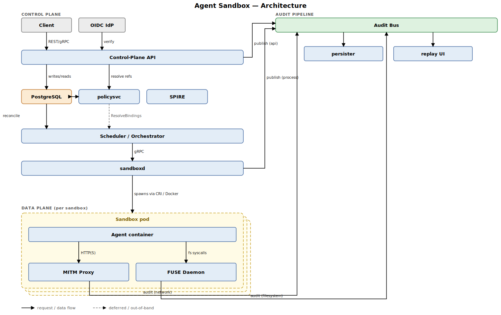

# Agent Sandbox Design Document

This document describes the implementation design for the Agent Sandbox platform whose functional requirements are specified in [README.md](README.md). It is the blueprint for building the system in Go, persisting state in PostgreSQL, and deploying identically on developer laptops (macOS, Linux), on-premise hardware, and cloud Kubernetes clusters.

> **Traceability.** Each requirement in [README.md](README.md) carries a stable `REQ-N` identifier. Individual statements in this document that implement a requirement end with an inline `(REQ-N)` tag (or `(REQ-N, REQ-M)` when a single statement covers multiple). To find every place the design satisfies a given requirement, `grep "REQ-N\b" DESIGN.md`.

## 1. Goals & Non-Goals

### Goals

- Provide a single declarative API for spinning up isolated, ephemeral execution environments for AI agents.
- Mediate **all** filesystem and network egress through platform-controlled enforcement points (FUSE, MITM proxy).
- Produce a tamper-evident, replayable audit trail of every agent action.
- Run unchanged on macOS / Linux laptops and Kubernetes clusters.
- Make the safe path the easy path: deny-by-default policies, brokered credentials, fail-closed components.

### Non-Goals

- Running untrusted agent _binaries_ with kernel-level guarantees on shared hosts. We rely on the chosen isolation backend (gVisor, Kata, microVM) for that and document its trade-offs.
- Replacing existing IAM/secrets systems. The platform integrates with HashiCorp Vault, AWS KMS, GCP KMS, and OIDC IdPs rather than reimplementing them.
- Real-time GPU multi-tenancy. v1 supports CPU/memory limits; GPU support is scoped for a follow-up.

## 2. High-Level Architecture

The architecture splits cleanly into a **control plane** (multi-tenant, cluster-wide, talks to PostgreSQL) and a **data plane** (per-sandbox, on a single node, mediates every agent action).



### 2.1 Process model

Every sandbox materializes as a **pod-like group** of three colocated processes sharing a network namespace and a workspace mount:

### Process model

Every sandbox instance materializes as a **pod-like group** of three colocated processes:

| Component       | Privilege                | Responsibility                                                                 |
| --------------- | ------------------------ | ------------------------------------------------------------------------------ |
| Agent container | Unprivileged, no `CAP_*` | Runs the user's agent. No direct network or host filesystem access.            |
| MITM proxy      | Net-namespace owner      | Sole egress path. TLS-intercepts, enforces egress policy, brokers credentials. |
| FUSE daemon     | Owns workspace mount     | Mediates every fs syscall. Enforces ACLs, quotas, COW, scanning.               |

The agent's network namespace is wired so the proxy is the only reachable host (default route → proxy listener); the agent's `/workspace` is the FUSE mount point.

## 3. Components

### 3.1 Control-Plane API Server (`cmd/apiserver`)

- **Language**: Go 1.23+.
- **Frameworks**: `connectrpc.com/connect` for transport (serves both gRPC and HTTP/JSON from one handler), `chi` for non-RPC routes (health, metrics, admin), `buf` for IDL tooling. (REQ-1)
- **Auth middleware**: OIDC (verifies ID tokens against tenant-bound JWKs), mTLS (cert subject → tenant), and signed API keys (Ed25519). All three resolve to a `Principal{TenantID, ActorID, Roles[]}`. (REQ-11)
- **Authorization**: in-process OPA evaluator (`open-policy-agent/opa`) with policies stored as code under `policies/`. Every API call evaluates `data.sandbox.allow` with `{principal, action, resource}` and the result is logged. (REQ-11, REQ-12)
- **Validation**: spec validation runs in two stages: (1) JSON-schema/protobuf field validation, (2) semantic validation (e.g., requested egress domains match an allowed pattern; requested resource limits within tenant quota). (REQ-2, REQ-13)
- **Idempotency**: `Idempotency-Key` header (or gRPC metadata) hashed with the request body and stored in a `idempotency_keys` table. Repeat calls within a 24 h window return the original response. (REQ-6)
- **Spec resolver**: when the request references a `profile`, the server merges the named profile with inline overrides, runs validation, and stores the _resolved_ spec on the sandbox row. Patches operate on the resolved spec. (REQ-15)
- **Streaming endpoints** (`/logs?follow`): served as Server-Sent Events for HTTP and bidi streams for gRPC. Backed by a fan-out subscriber on the audit bus. (REQ-9, REQ-65)

### 3.2 Scheduler (`cmd/scheduler`)

A control-loop reconciler. Watches `sandboxes` rows in `desired_state ∈ {pending, running, deleted}` and drives them through a state machine:

```
pending → placing → starting → running → draining → terminated
                                   │
                                   └─→ failed (with reason)
```

- Placement: in Kubernetes, the scheduler creates a `Sandbox` CRD; a custom controller materializes it as a Pod with the agent + sidecars. Locally, the scheduler talks to a `sandboxd` daemon over the same gRPC + mTLS channel used in K8s — one transport, one auth model, in every environment.
- Heartbeats: each sandbox's `sandboxd` reports liveness every 5 s; missing 3 heartbeats marks the sandbox `failed`.
- Leases: scheduler instances elect a leader via a PostgreSQL advisory lock so multiple replicas can run for HA without double-acting on the same sandbox.

### 3.3 Runtime Agent (`cmd/sandboxd`)

The node-local daemon that performs the actual sandbox lifecycle work. One per node.

- Pluggable **isolation backend** behind a single Go interface:
  ```go
  type Runtime interface {
      Create(ctx context.Context, spec *Spec) (Handle, error)
      Start(ctx context.Context, h Handle) error
      Exec(ctx context.Context, h Handle, req ExecRequest) (ExecResult, error)
      Stop(ctx context.Context, h Handle, grace time.Duration) error
      Destroy(ctx context.Context, h Handle) error
  }
  ```
  This abstracts the runtime so any backend with comparable isolation semantics is swappable. (REQ-17, REQ-61)
- Implementations: `runtime/runc` (OCI-compatible, default), `runtime/gvisor`, `runtime/kata`, `runtime/firecracker`. Selection comes from `spec.isolation`. (REQ-2, REQ-22)
- Spawns the per-sandbox MITM proxy and FUSE daemon as siblings _before_ starting the agent container, so by the time the agent runs the egress path and workspace are already mediated. (REQ-23, REQ-48)
- Applies per-spec resource limits via cgroups v2 (CPU, memory, pids, IO) and a wall-clock killer goroutine for `resources.timeout`. (REQ-18)
- Drops privileges on the agent container per `security`: non-root user, empty capability set, `readOnlyRoot`, mounted seccomp profile. (REQ-20, REQ-21)
- Exposes a thin gRPC API to the scheduler for create/start/exec/stop/destroy and to stream stdout/stderr to the audit bus. (REQ-10)

#### Multiplexing: one sandboxd, many sandbox Pods

A node hosts many sandbox Pods, and the single sandboxd on that node manages all of them. Every gRPC call carries a `Handle`; sandboxd keeps a per-handle state map and creates the per-sandbox cgroup, netns, and FUSE mount as siblings under its own roots. Capacity per node is bounded by the cluster scheduler's resource accounting on the Pod spec, not by sandboxd itself. The shape:

- **N:1 multiplexing.** On node X, sandboxd handles every sandbox Pod scheduled to X. Sandboxes on node Y are managed by Y's sandboxd — there is no cross-node call path between sandboxd instances.
- **Colocation is structural, not network-routed.** When a sandbox Pod is scheduled to node X, the kubelet's CSI plumbing reaches the FUSE driver on X, and the cgroup / namespace setup runs in X's kernel. There is no scenario where a Pod on X is "managed by" sandboxd on Y. (See §11.2 for the matching `nodeSelector` between the DaemonSet and the sandbox Pod template that prevents Pods from landing on a node without sandboxd.)
- **Audit isolation holds across multiplexing.** Every event still carries `(tenant_id, sandbox_id)` so per-sandbox and per-tenant invariants survive even though the producer process is shared. (REQ-69)
- **Blast radius of a sandboxd crash.** Lifecycle management for *every* sandbox on the node hangs until sandboxd restarts. The sandbox Pods themselves keep running (their containers are independent processes); new exec calls and teardowns block. This is distinct from a per-sandbox FUSE-daemon crash (§3.5), which is fail-closed for one sandbox only.

### 3.4 MITM Proxy (`cmd/sbxproxy`)

- Built on `github.com/elazarl/goproxy` for the HTTP layer plus a thin custom TLS interceptor that uses a per-sandbox CA loaded at startup. The proxy is the sandbox's only egress path. (REQ-23, REQ-25)
- The CA is generated per-sandbox by `policysvc` (never reused across tenants) and the private key is mounted from a `tmpfs` volume only the proxy can read; the public cert is the only thing exposed to the agent. (REQ-26, REQ-27)
- Policy evaluator runs OPA-as-lib with the sandbox's egress block compiled to a Rego module; decisions are cached in-memory keyed by `(host, method, path-prefix)`. Default verdict is deny; allow rules come from the spec's per-task egress block. (REQ-31, REQ-32)
- Body inspection is streaming: requests/responses pass through pluggable inspectors (`secrets`, `pii`, `prompt-injection`, `clamav`) that share a `Reader` chain so we don't buffer entire bodies unless an inspector requests it. (REQ-44)
- Upload size cap and content-type allow/deny lists are enforced before bodies are forwarded; violations produce a 413/415 and a deny event. (REQ-34, REQ-38)
- Inbound auth-like headers (`Authorization`, `Cookie`, `X-Api-Key`, …) are handled per the egress block's `inboundAuthHeaders` field — `strip` (default), `reject`, or `passthrough`. (REQ-36)
- Credential broker: at sandbox creation, the API resolves each credential reference and pushes the secret material into the proxy's keyring over the same gRPC + mTLS channel used elsewhere. The proxy attaches headers per the egress block's `credentialBindings`. Credentials never touch disk and never appear in any log (audit log entries store an HMAC-SHA256 of the value with a per-sandbox salt). (REQ-35, REQ-37, REQ-42, REQ-43)
- Bandwidth and request-rate limiting via leaky-bucket per `(sandbox, destination)` and per tenant. (REQ-33)

### 3.5 FUSE Daemon (`cmd/sbxfuse`)

- The agent's `/workspace` is a userspace FUSE mount; every read/write/stat/unlink goes through this daemon, never the kernel directly. (REQ-48)
- Uses `bazil.org/fuse` on Linux and `bazil.org/fuse` against macFUSE on macOS, behind a thin abstraction (`fs.Mounter`); behavior and audit format are identical on both. (REQ-55)
- The daemon runs out-of-process and unprivileged; if it crashes the kernel returns `EIO` for every workspace op and `sandboxd` pauses the agent until the daemon restarts. (REQ-52)
- Pluggable **backend** interface:
  ```go
  type Backend interface {
      Open(ctx context.Context, path string, flags int) (File, error)
      ReadDir(ctx context.Context, path string) ([]Entry, error)
      Lookup(ctx context.Context, path string) (Attr, error)
      // ... rename, unlink, mkdir, symlink, etc.
  }
  ```
- Implementations: `backend/local` (host directory with a chroot-like jail), `backend/s3`, `backend/gcs`, `backend/encrypted` (age-encrypted blocks over any of the above) — policy is backend-agnostic. (REQ-53)
- Only the workspace path declared in the spec is exposed to the agent; sensitive host paths (`~/.ssh`, `~/.aws`, etc.) are never mounted. (REQ-45, REQ-46)
- ACL layer sits _above_ the backend: every op is checked against the per-path policy compiled from the spec's `filesystem` block. Denied paths return `ENOENT` (not `EACCES`) to avoid revealing existence. (REQ-49)
- Every op (`read`, `write`, `unlink`, `rename`, `chmod`, `setxattr`) emits an audit event on the same bus as network and process events for unified replay. (REQ-50)
- COW overlay: writes go to an upper layer (a tmpfs-backed `local` backend); reads first check the upper layer, then fall through to the read-only base. On session end the upper layer is destroyed; if `persistArtifacts` is set, listed paths are copied to the artifact bucket first via a signed URL. (REQ-19, REQ-47, REQ-51)
- Quotas tracked via in-memory counters checkpointed to PostgreSQL every 30 s; on restart the daemon re-walks the upper layer to rebuild counters. (REQ-18)
- Inline scanning runs on writes via the same inspector chain as the proxy (shared `inspect/` package). Flagged writes are buffered to a quarantine path and the agent receives `EIO`. (REQ-44)
- Workspace snapshots can be triggered via `POST /sandboxes/{id}/snapshots` for forensic capture and reproducible session replay. (REQ-54)

### 3.6 Audit Bus

- **Kafka** for the audit bus across all deployment modes. Abstracted behind:
  ```go
  type EventBus interface {
      Publish(ctx context.Context, topic string, event Event) error
      Subscribe(ctx context.Context, topic string, opts SubOpts) (<-chan Event, error)
  }
  ```
- Topics: `audit.network`, `audit.filesystem`, `audit.process`, `audit.api`, `audit.policy`. All events share the schema in §9.1 (timestamp, tenant ID, sandbox ID, actor, type, payload). (REQ-39)
- A **persister** consumer writes events into S3/GCS object storage (Parquet, daily roll-up; retention configurable per-tenant). Bodies (request/response, file contents) are stored alongside event metadata for forensic review. PostgreSQL holds only the system-of-record control-plane state — audit events do not live in PG. (REQ-40, REQ-63, REQ-70)
- Tamper evidence: each event carries `prev_hash` chained per-sandbox; the persister verifies and rejects breaks. Daily root hashes are signed with a platform Ed25519 key and published to a transparency log. (REQ-41)

### 3.7 Policy & Secrets Service (`cmd/policysvc`)

- Stores reusable sandbox profiles, RBAC roles, and tenant quotas. Backed by PostgreSQL. (REQ-11, REQ-15)
- Tenant-specific profiles overlay the platform-global ones — a tenant can tighten or override defaults for its own sandboxes without touching the global rows. (REQ-71)
- Acts as the credential-reference resolver: when the API receives a sandbox spec, it asks `policysvc` to resolve each credential reference (`vault://...`, `awskms://...`, `gcpkms://...`) into a short-lived secret bundle, which is pushed directly to the new sandbox's MITM proxy. The bundle never traverses the API server. (REQ-42, REQ-43)

## 4. Data Model (PostgreSQL)

PostgreSQL 15+ is the system of record for all control-plane state. Audit events do not live in PostgreSQL; they go straight from the bus to object storage via the persister.

```sql
-- Tenancy
CREATE TABLE tenants (
    id              UUID PRIMARY KEY,
    name            TEXT NOT NULL UNIQUE,
    quotas          JSONB NOT NULL DEFAULT '{}'::jsonb,
    created_at      TIMESTAMPTZ NOT NULL DEFAULT now()
);

CREATE TABLE actors (
    id              UUID PRIMARY KEY,
    tenant_id       UUID NOT NULL REFERENCES tenants(id),
    kind            TEXT NOT NULL CHECK (kind IN ('user','service','apikey')),
    external_id     TEXT NOT NULL, -- OIDC subject or cert fingerprint
    roles           TEXT[] NOT NULL DEFAULT '{}',
    UNIQUE (tenant_id, kind, external_id)
);

-- Profiles
CREATE TABLE sandbox_profiles (
    id              UUID PRIMARY KEY,
    tenant_id       UUID REFERENCES tenants(id), -- NULL = platform-global
    name            TEXT NOT NULL,
    spec            JSONB NOT NULL,
    version         INT NOT NULL,
    created_at      TIMESTAMPTZ NOT NULL DEFAULT now(),
    UNIQUE (tenant_id, name, version)
);

-- Sandboxes (the core entity)
CREATE TABLE sandboxes (
    id                UUID PRIMARY KEY,
    tenant_id         UUID NOT NULL REFERENCES tenants(id),
    actor_id          UUID NOT NULL REFERENCES actors(id),
    spec              JSONB NOT NULL,            -- resolved spec
    spec_hash         BYTEA NOT NULL,            -- SHA256 over canonical spec
    desired_state     TEXT NOT NULL CHECK (desired_state IN ('running','deleted')),
    actual_state      TEXT NOT NULL DEFAULT 'pending',
    state_reason      TEXT,
    node_id           TEXT,                      -- assigned by scheduler
    created_at        TIMESTAMPTZ NOT NULL DEFAULT now(),
    started_at        TIMESTAMPTZ,
    terminated_at     TIMESTAMPTZ
);
CREATE INDEX sandboxes_tenant_state_idx ON sandboxes (tenant_id, actual_state);
CREATE INDEX sandboxes_reconcile_idx ON sandboxes (actual_state) WHERE actual_state IN ('pending','starting','draining');

-- Idempotency
CREATE TABLE idempotency_keys (
    key_hash          BYTEA PRIMARY KEY,
    tenant_id         UUID NOT NULL,
    response_code     INT NOT NULL,
    response_body     BYTEA NOT NULL,
    created_at        TIMESTAMPTZ NOT NULL DEFAULT now()
);
-- Background job purges rows > 24h old.

-- Credential references (no secret values stored here)
CREATE TABLE credential_bindings (
    id                UUID PRIMARY KEY,
    sandbox_id        UUID NOT NULL REFERENCES sandboxes(id) ON DELETE CASCADE,
    destination_glob  TEXT NOT NULL,             -- e.g. "api.github.com/*"
    header_name       TEXT NOT NULL,             -- e.g. "Authorization"
    reference_uri     TEXT NOT NULL,             -- e.g. "vault://kv/data/gh-token#token"
    created_at        TIMESTAMPTZ NOT NULL DEFAULT now()
);

-- (Audit events are persisted directly to object storage by the persister consumer;
--  no audit table lives in PostgreSQL.)

-- Filesystem snapshots (metadata; bytes live in object storage)
CREATE TABLE workspace_snapshots (
    id                UUID PRIMARY KEY,
    sandbox_id        UUID NOT NULL REFERENCES sandboxes(id),
    bucket            TEXT NOT NULL,
    object_key        TEXT NOT NULL,
    size_bytes        BIGINT NOT NULL,
    sha256            BYTEA NOT NULL,
    created_at        TIMESTAMPTZ NOT NULL DEFAULT now()
);

-- Per-tenant quotas / counters (incremented atomically)
CREATE TABLE tenant_usage (
    tenant_id         UUID PRIMARY KEY REFERENCES tenants(id),
    active_sandboxes  INT NOT NULL DEFAULT 0,
    cpu_cores         NUMERIC NOT NULL DEFAULT 0,
    memory_mb         BIGINT NOT NULL DEFAULT 0,
    updated_at        TIMESTAMPTZ NOT NULL DEFAULT now()
);
```

### Multi-tenancy isolation in PostgreSQL

- All queries that touch tenant data go through a `WithTenant(ctx, tenantID)` repository helper that injects `tenant_id = $1` into every WHERE clause. (REQ-69)
- We additionally enable PostgreSQL **Row-Level Security** on tenant-bearing tables and run app sessions under a role whose `current_setting('app.tenant_id')` is set per-request — defense in depth in case a query is missed. (REQ-69)

## 5. Sandbox Spec Schema

Specs are versioned (`apiVersion: sandbox.platform/v1`) — the canonical declarative input that drives sandbox creation. Canonical form is Protobuf; JSON is the wire format for HTTP. The `security` block (REQ-3), `filesystem` block (REQ-4), and `egress` block (REQ-5) are mandatory; `profile` references a server-side reusable profile (REQ-15). Example (JSON): (REQ-2)

```json
{
  "apiVersion": "sandbox.platform/v1",
  "profile": "code-review-strict",
  "image": "registry.local/agents/coderev:1.4",
  "isolation": "gvisor",
  "resources": {
    "cpu": "1",
    "memory": "2Gi",
    "disk": "10Gi",
    "timeout": "30m"
  },
  "security": {
    "user": "10001:10001",
    "readOnlyRoot": true,
    "capabilities": { "drop": ["ALL"] },
    "seccomp": "platform/default-strict.json"
  },
  "env": [{ "name": "AGENT_TASK", "value": "review the diff in /workspace" }],
  "filesystem": {
    "backend": "local",
    "workspace": "/workspace",
    "acls": [
      { "path": "/workspace/**", "access": "rw" },
      { "path": "/etc/**", "access": "ro" },
      { "path": "/home/**", "access": "deny" }
    ],
    "quotas": { "bytes": "5Gi", "inodes": 100000, "maxFile": "100Mi" },
    "cow": true,
    "persistArtifacts": ["/workspace/out/**"]
  },
  "egress": {
    "allow": [
      {
        "host": "api.github.com",
        "methods": ["GET", "POST"],
        "paths": ["/repos/*"]
      },
      { "host": "*.pypi.org", "methods": ["GET"] }
    ],
    "rateLimits": [
      { "match": { "host": "api.github.com" }, "rps": 10, "burst": 20 }
    ],
    "credentialBindings": [
      {
        "match": { "host": "api.github.com" },
        "header": "Authorization",
        "valueRef": "vault://kv/data/gh-tokens#bearer"
      }
    ],
    "uploadMaxBytes": "5Mi",
    "contentTypes": {
      "deny": ["application/x-executable", "application/x-mach-binary"]
    }
  }
}
```

The same shape in Go (canonical JSON tags; resource quantities kept as strings so the k8s-style suffixes round-trip — parse them once during validation):

```go
package sandboxv1

// Spec is the top-level sandbox specification (apiVersion: sandbox.platform/v1).
// Canonical form is Protobuf; this struct is the JSON wire shape.
type Spec struct {
	APIVersion string    `json:"apiVersion"`        // e.g. "sandbox.platform/v1"
	Profile    string    `json:"profile,omitempty"` // Named profile to merge under inline overrides.
	Image      string    `json:"image"`             // OCI image reference for the agent container.
	Isolation  Isolation `json:"isolation"`         // Backend selector: gvisor|runc|kata|firecracker.

	Resources  Resources  `json:"resources"`
	Security   Security   `json:"security"`
	Env        []EnvVar   `json:"env,omitempty"` // Env vars set on the agent process at start.
	Filesystem Filesystem `json:"filesystem"`
	Egress     Egress     `json:"egress"`
}

// EnvVar is a non-secret env var. For secrets, use egress.credentialBindings
// (header injection by the proxy) — never put secret material in plaintext here.
type EnvVar struct {
	Name  string `json:"name"`
	Value string `json:"value"`
}

// Isolation selects the runtime backend. See cmd/sandboxd Runtime implementations.
type Isolation string

const (
	IsolationRunc        Isolation = "runc"
	IsolationGVisor      Isolation = "gvisor"
	IsolationKata        Isolation = "kata"
	IsolationFirecracker Isolation = "firecracker"
)

// Resources are k8s-style quantity strings ("1", "2Gi", "30m"); validated server-side
// against tenant quota.
type Resources struct {
	CPU     string `json:"cpu"`     // CPU cores or millicores ("1", "500m").
	Memory  string `json:"memory"`  // Memory quantity ("2Gi").
	Disk    string `json:"disk"`    // Workspace upper-layer size ("10Gi").
	Timeout string `json:"timeout"` // Wall-clock TTL as Go duration ("30m").
}

// Security covers the agent process's POSIX/Linux hardening posture.
type Security struct {
	User         string       `json:"user"`         // "uid:gid" the agent runs as; never 0.
	ReadOnlyRoot bool         `json:"readOnlyRoot"` // Mount `/` read-only inside the container.
	Capabilities Capabilities `json:"capabilities"`
	Seccomp      string       `json:"seccomp"` // Profile path/name shipped with the platform.
}

// Capabilities controls Linux capability bounding. Drop precedes Add.
type Capabilities struct {
	Drop []string `json:"drop,omitempty"` // Use ["ALL"] for deny-by-default.
	Add  []string `json:"add,omitempty"`  // Re-add only what the workload truly needs.
}

// Filesystem configures the FUSE-mediated workspace.
type Filesystem struct {
	Backend          FSBackend `json:"backend"`                    // local|s3|gcs|encrypted
	Workspace        string    `json:"workspace"`                  // Mount point inside the agent container.
	ACLs             []ACLRule `json:"acls"`                       // Longest-prefix-match; denied paths return ENOENT.
	Quotas           Quotas    `json:"quotas"`
	COW              bool      `json:"cow"`                        // Copy-on-write upper layer on tmpfs.
	PersistArtifacts []string  `json:"persistArtifacts,omitempty"` // Globs uploaded to backend on teardown.
}

type FSBackend string

const (
	FSBackendLocal     FSBackend = "local"
	FSBackendS3        FSBackend = "s3"
	FSBackendGCS       FSBackend = "gcs"
	FSBackendEncrypted FSBackend = "encrypted"
)

// ACLRule grants Access on paths matching Path (supports `**` globs).
type ACLRule struct {
	Path   string    `json:"path"`
	Access ACLAccess `json:"access"`
}

type ACLAccess string

const (
	ACLAccessRW   ACLAccess = "rw"
	ACLAccessRO   ACLAccess = "ro"
	ACLAccessDeny ACLAccess = "deny"
)

// Quotas bound the workspace's COW upper layer.
type Quotas struct {
	Bytes   string `json:"bytes"`   // Total byte cap ("5Gi").
	Inodes  int64  `json:"inodes"`  // Total inode cap.
	MaxFile string `json:"maxFile"` // Per-file size cap ("100Mi").
}

// Egress configures the per-sandbox MITM proxy that owns the sandbox's only route out.
type Egress struct {
	TLSIntercept       bool                `json:"tlsIntercept"`                 // If false, only host+bytes are logged for matched dests.
	Allow              []EgressAllow       `json:"allow"`                        // Allowlist; everything else is 403'd.
	RateLimits         []RateLimit         `json:"rateLimits,omitempty"`
	InboundAuthHeaders InboundAuthPolicy   `json:"inboundAuthHeaders"`           // Handling of agent-supplied auth headers; see below.
	CredentialBindings []CredentialBinding `json:"credentialBindings,omitempty"`
	UploadMaxBytes     string              `json:"uploadMaxBytes,omitempty"`     // Per-request body cap ("5Mi").
	ContentTypes       *ContentTypePolicy  `json:"contentTypes,omitempty"`
}

// InboundAuthPolicy controls what the proxy does with Authorization/auth-style
// headers the workload set on outbound requests. "strip" forces all auth to come
// from CredentialBindings (the broker), preserving audit-trail integrity.
type InboundAuthPolicy string

const (
	InboundAuthStrip       InboundAuthPolicy = "strip"
	InboundAuthPassthrough InboundAuthPolicy = "passthrough"
	InboundAuthReplace     InboundAuthPolicy = "replace" // Strip only when a binding matches.
)

// EgressAllow is a coarse host+method+path allowlist entry. Host supports `*` wildcards.
type EgressAllow struct {
	Host    string   `json:"host"`              // e.g. "api.github.com" or "*.pypi.org"
	Methods []string `json:"methods,omitempty"` // Default: any.
	Paths   []string `json:"paths,omitempty"`   // Glob patterns; default: any.
}

// RateLimit is a leaky-bucket scoped to (sandbox, match).
type RateLimit struct {
	Match HostMatch `json:"match"`
	RPS   int       `json:"rps"`
	Burst int       `json:"burst"`
}

// HostMatch is the shared selector used by RateLimit and CredentialBinding.
type HostMatch struct {
	Host string `json:"host"` // Exact or wildcard.
}

// CredentialBinding tells the proxy to inject Header with the value resolved from
// ValueRef whenever an outbound request matches Match. Values are pushed to the
// proxy keyring out-of-band; never stored in PG, never logged in cleartext.
type CredentialBinding struct {
	Match    HostMatch `json:"match"`
	Header   string    `json:"header"`   // Typically "Authorization".
	ValueRef string    `json:"valueRef"` // e.g. "vault://kv/data/gh-tokens#bearer"
}

// ContentTypePolicy gates request bodies by Content-Type. Deny precedes Allow.
type ContentTypePolicy struct {
	Deny  []string `json:"deny,omitempty"`
	Allow []string `json:"allow,omitempty"`
}
```

## 6. Control-Plane API Surface

All endpoints live under `/v1/`. The same surface is exposed as gRPC services in the `sandbox.v1` package generated from the same protos. (REQ-1)

| Method                | Path                          | Description                            | REQ           |
| --------------------- | ----------------------------- | -------------------------------------- | ------------- |
| POST                  | `/sandboxes`                  | Create a sandbox.                      | REQ-2, REQ-6  |
| GET                   | `/sandboxes/{id}`             | Get current state and resolved spec.   | REQ-6         |
| PATCH                 | `/sandboxes/{id}`             | Tighten policy (loosen → 409).         | REQ-7         |
| DELETE                | `/sandboxes/{id}`             | Terminate and tear down.               | REQ-8         |
| GET                   | `/sandboxes/{id}/logs`        | Filtered logs; `?follow=true` streams. | REQ-9, REQ-65 |
| POST                  | `/sandboxes/{id}/exec`        | One-shot command.                      | REQ-10        |
| POST                  | `/sandboxes/{id}/files`       | Upload to the workspace (multipart).   | REQ-47        |
| GET                   | `/sandboxes/{id}/files/*path` | Download from the workspace.           | REQ-47        |
| GET                   | `/sandboxes/{id}/snapshots`   | List forensic snapshots.               | REQ-54        |
| POST                  | `/sandboxes/{id}/snapshots`   | Trigger a snapshot now.                | REQ-54        |
| GET/POST/PATCH/DELETE | `/profiles`                   | Manage reusable profiles.              | REQ-15        |

Every mutating endpoint accepts an `Idempotency-Key` header. (REQ-6) `?dryRun=true` returns the _resolved_ spec and policy decision without side effects. (REQ-16)

## 7. Network Path

### 7.1 Egress wiring

On Linux:

- The sandbox container is placed in its own network namespace with no default route except a single rule sending TCP traffic on ports 80/443 to the proxy, and _all other traffic dropped_ (`iptables -A OUTPUT -j DROP`). (REQ-23, REQ-24)
- DNS is forced through the proxy's resolver — no other DNS path is reachable from the netns, eliminating DNS exfiltration. (REQ-28)
- A dedicated `nftables` ruleset on the host blocks `169.254.169.254/32` and `fd00:ec2::254/128` regardless of container policy. (REQ-30)
- IPv6 is disabled per-namespace unless the proxy advertises IPv6 too. (REQ-29)

On macOS (developer mode):

- Sandboxes run in a Linux VM (Lima or OrbStack); the same iptables wiring applies inside the VM. (REQ-57)

### 7.2 TLS interception

- Per-sandbox CA generated at sandbox creation by `policysvc`. Public cert pushed into the sandbox image's trust bundle (`/etc/ssl/certs/sbx-ca.pem` + `update-ca-certificates`); private key passed only to the proxy via a memfd. (REQ-25, REQ-26, REQ-27)
- For non-HTTP TLS or pinned clients (e.g. some Go binaries that refuse system roots), the spec can disable `tlsIntercept` for specific destinations — but at the cost of inspection (we still log host + bytes, just not headers/body).

### 7.3 Policy decision flow

```
agent → connect → proxy intercept → resolve dest → OPA decide → allow?
                                                                  │
                                                    yes ─────────┘├── inject creds (if binding)
                                                                  ├── stream body through inspectors
                                                                  └── forward to upstream, audit
                                                    no ────────────── return 403, audit deny
```

The "decide" step uses the per-sandbox egress allowlist. (REQ-31) "Inject creds" pulls from the proxy keyring populated by the credential broker. (REQ-35) Both `allow` and `deny` outcomes emit audit events. (REQ-39)

## 8. Filesystem Path

### 8.1 Mount lifecycle

1. `sandboxd` calls the FUSE daemon's `Mount(spec)` RPC. (REQ-48)
2. Daemon creates the upper (COW) layer on tmpfs sized to the quota; lower layer is the configured backend. (REQ-51, REQ-53)
3. Daemon mounts at `/var/lib/sbx/<sandbox-id>/workspace`.
4. `sandboxd` bind-mounts that path into the agent container at `spec.filesystem.workspace` — only the spec-declared workspace is exposed. (REQ-45)
5. On teardown: optional snapshot → unmount → destroy upper layer. (REQ-19, REQ-54)

### 8.2 ACL evaluation

- Spec ACLs compile to a longest-prefix-match trie. Lookups are O(path-depth). Sensitive host paths (`~/.ssh`, `~/.aws`, etc.) are deny-listed and return `ENOENT`. (REQ-46, REQ-49)
- Decision cache keyed by `(path, op)` with a small LRU; invalidated on PATCH.
- Audit emission: every `read`, `write`, `unlink`, `rename`, `chmod`, `setxattr` op produces an event (sampled for high-frequency reads to avoid drowning the bus — sampling preserves all denies and all writes). (REQ-50)

### 8.3 Cross-platform abstraction

A single `fs.Mounter` interface has implementations:

- `mounter/linux_fuse3.go` (libfuse3 via cgo or pure-Go bazil/fuse)
- `mounter/darwin_macfuse.go` (macFUSE via the same bazil/fuse import — bazil supports both)
- `mounter/k8s_csi.go` (talks to the platform's CSI driver and asks for a `bidirectional` propagated mount, so the agent container sees the mediated mount without needing `SYS_ADMIN`) (REQ-56)

Build tags select the implementation; the rest of the daemon (ACL, COW, audit, scanning) is platform-agnostic. (REQ-55)

## 9. Audit & Replay

### 9.1 Event schema

A single shared schema for every event source — network, filesystem, process, API, policy — keyed by tenant and sandbox so a complete session timeline can be reconstructed. (REQ-39)

```go
type Event struct {
    ID         uint64    // assigned by persister
    OccurredAt time.Time // monotonic + wall, set at source
    TenantID   uuid.UUID
    SandboxID  uuid.UUID
    ActorID    uuid.UUID
    Type       string    // network|filesystem|process|api|policy
    Payload    json.RawMessage
    PrevHash   []byte    // SHA256 of previous event's SelfHash, per-sandbox chain
    SelfHash   []byte    // SHA256(prev_hash || canonical(payload) || occurred_at)
}
```

The `PrevHash` chain makes the per-sandbox event log tamper-evident — any break is detected by the persister and surfaced as a verification failure. (REQ-41) Every API mutation (create/PATCH/DELETE/exec) produces an `api`-typed event capturing the actor, spec hash, and decision. (REQ-12)

### 9.2 Pipeline

```
 source → bus (Kafka) → persister → object storage (Parquet, daily roll-up)
```

The persister stores full request/response bodies and file contents alongside event metadata, subject to the per-tenant retention policy. (REQ-40)

### 9.3 Replay UI

A separate read-only service (`cmd/replay`) serves a web UI that reconstructs a session timeline from the audit events: HTTP transactions, file ops, exec calls, and API mutations interleaved by `occurred_at`. Events and bodies are fetched lazily from object storage with HMAC-authorized URLs. The same backing data feeds the live action stream consumed by interactive clients. (REQ-65)

## 10. Secrets & Credential Brokering

The spec carries only credential _references_, not values — the agent process never sees raw secrets. (REQ-35, REQ-42)

```
Client spec includes:
  egress.credentialBindings[i].valueRef = "vault://kv/data/gh-tokens#bearer"   (REQ-5)

API server:
  validates ref format + RBAC (this principal may use this ref?)
  inserts row into credential_bindings (no value)

Scheduler/runtime, on sandbox start:
  policysvc.ResolveBindings(sandboxID) → returns short-lived bundle
  bundle pushed via gRPC (mTLS) → sbxproxy keyring
  proxy holds in memory only

On request:
  proxy matches dest → looks up binding → injects header → forwards
  audit event records the binding ID, never the value      (REQ-37)
```

Credentials never reach the API server response, the agent container, or PostgreSQL. They are scoped per session and revoked by: (REQ-43)

- `DELETE /sandboxes/{id}` → proxy zeroizes its keyring.
- Policy violation → controller signals proxy to revoke a single binding without killing the sandbox.

Outbound bodies pass through the proxy's `secrets` inspector before forwarding (and FUSE writes through the same chain before persistence) — flagged content is quarantined rather than leaked. (REQ-44)

## 11. Deployment Topologies

The same images, the same policies, and the same audit format apply across every mode below — laptop and production are feature-equal except for scale. (REQ-57)

### 11.1 Local (laptop)

- `docker compose up` brings up: PostgreSQL, Kafka (single-broker KRaft mode), apiserver, scheduler, one `sandboxd` (Docker-in-Docker), and an ingress (Caddy) for TLS. (REQ-58)
- A `sandbox` CLI (`go install ./cmd/sandbox`) calls the local API.
- macOS uses an OrbStack/Lima VM behind the scenes so Linux namespaces are available.

### 11.2 Kubernetes

- **Helm chart** under `deploy/helm/sandbox` with subcharts: `apiserver`, `scheduler`, `policysvc`, `audit-pipeline`, `replay`, plus a CRD bundle. (REQ-59)
- `sandboxd` runs as a privileged DaemonSet; sandboxes themselves are unprivileged Pods materialized by a `Sandbox` CRD controller. (REQ-22)
- FUSE on K8s: a CSI driver (`csi.sandbox.platform`) installed via DaemonSet; the FUSE daemon runs as a sidecar with `mountPropagation: Bidirectional` so the mount is visible to the agent container without needing `SYS_ADMIN` on the agent. (REQ-56)
- Distributions: tested on EKS, GKE, AKS, OpenShift, vanilla `kind`. Air-gapped clusters are supported by mirroring all images to a private registry and pinning charts by digest. (REQ-60)
- Container runtime works against containerd, CRI-O, and Docker; gVisor or Kata is selectable per spec for stronger isolation. (REQ-61)

### 11.3 On-prem / cloud non-K8s

- Single-binary `sandboxd` + systemd unit for bare-metal. Pluggable runtimes (containerd or Firecracker).
- Terraform modules under `deploy/terraform/{aws,gcp,azure}` for VPC/IAM/buckets/KMS. (REQ-62)
- All persistent state (audit object storage, snapshots, profiles, secrets refs) lives behind pluggable interfaces — no hard dependency on a specific cloud provider's proprietary services. (REQ-63)
- A CI matrix exercises macOS, Linux (amd64 + arm64), and a `kind` Kubernetes cluster end-to-end on every release. (REQ-64)

## 12. Observability

- **Metrics**: Prometheus, with stable labels `tenant_id`, `sandbox_id` (low-cardinality alternatives where needed). Key SLIs: API latency p50/p99, sandbox start time, proxy decision latency, FUSE op latency, audit event lag. These metrics also feed the anomaly detector that flags egress-volume spikes, new-domain ratios, and unusual filesystem activity. (REQ-68)
- **Tracing**: OpenTelemetry. Trace context flows from API → scheduler → sandboxd → proxy → upstream so a single agent action can be reconstructed end-to-end.
- **Logs**: structured JSON via `slog` (Go 1.22+). All logs include `tenant_id`, `sandbox_id`, `trace_id`.
- **Live action stream**: clients can `GET /sandboxes/{id}/logs?follow=true` (SSE / gRPC stream) to watch tool calls, file edits, and network requests in real time. (REQ-65)
- **Dashboards**: Grafana JSON shipped under `deploy/dashboards/`.

## 13. Failure Modes & Fail-Closed Semantics

| Component      | Failure           | Behavior                                                                                                                                                                                        | REQ    |
| -------------- | ----------------- | ----------------------------------------------------------------------------------------------------------------------------------------------------------------------------------------------- | ------ |
| MITM proxy     | Crash / unhealthy | sandboxd suspends agent (SIGSTOP), tries restart; on second failure terminates sandbox.                                                                                                         | REQ-8  |
| FUSE daemon    | Crash             | Workspace becomes inaccessible (kernel returns EIO); sandbox paused; audit event emitted; daemon restarts and remounts COW upper layer.                                                         | REQ-52 |
| Policy service | Unreachable       | API server rejects new sandbox creates (503); existing sandboxes keep running with their cached policies.                                                                                       |        |
| PostgreSQL     | Read replica down | API server falls back to primary for reads; alerts fire.                                                                                                                                        |        |
| PostgreSQL     | Primary down      | Mutating endpoints return 503; scheduler stops reconciling; running sandboxes continue to serve traffic.                                                                                        |        |
| Audit bus      | Backed up         | Source-side bounded buffer (1 MiB) → spillover to local disk → bus recovery drains. If disk full, sandbox is terminated rather than running un-audited.                                         | REQ-39 |
| Object storage | Down              | Persister buffers to a bounded local spool (per the audit-bus rule above); resumes draining once storage recovers. If the spool fills, sandboxes are terminated rather than running un-audited. |        |

The platform-wide invariant: **no agent action proceeds if it cannot be audited and policy-checked.**

A user-initiated `DELETE /sandboxes/{id}` is the kill switch — it guarantees process termination, FUSE unmount, audit flush, and ephemeral storage destruction. (REQ-8, REQ-66)

## 14. Security Considerations

- **Container escape**: defense in depth — userns + seccomp + AppArmor on Linux, gVisor or Kata for hostile workloads. Privileges are dropped (non-root user, empty capability set, read-only system dirs) before the agent runs. (REQ-20, REQ-21, REQ-22)
- **Proxy bypass**: the only egress path is the proxy, and the agent has no `CAP_NET_RAW`, no `/dev/tcp`, no raw sockets. DNS goes through the proxy. We routinely fuzz with TLS bypass, SNI smuggling, HTTP smuggling, and DNS rebinding payloads. (REQ-23, REQ-24, REQ-28, REQ-30)
- **FUSE bypass**: agent has no path under `/proc` or `/dev` other than what the spec allows; `/proc` is masked with read-only overlays and `/proc/<pid>` from outside the sandbox is filtered. (REQ-46)
- **Side channels**: per-tenant cgroups; we accept the residual risk on shared CPUs and document it. (REQ-69)
- **Supply chain**: all images built reproducibly with SLSA-3 provenance, scanned in CI, signed with `cosign`; the `apiVersion`-pinned spec records the image digest. (REQ-72)
- **Authn/z fuzzing**: dedicated `cmd/securitytest` exercises the API with malformed tokens, expired certs, role escalation attempts. (REQ-11)

## 15. Cross-Cutting Engineering Conventions

- **Module layout** (`go.mod` is the repo root; one module). The `pkg/sandboxv1/` package holds generated protos consumed by the public Python, TypeScript, and Go client SDKs (built via `buf generate`). (REQ-14)
  ```
  cmd/
    apiserver/  scheduler/  sandboxd/  sbxproxy/  sbxfuse/  policysvc/  replay/  sandbox/
  internal/
    api/        spec/       runtime/    proxy/     fs/         audit/
    auth/       policy/     secrets/    storage/   config/     telemetry/
  pkg/
    sandboxv1/  (generated protos, public)
  deploy/
    helm/       terraform/  compose/    dashboards/
  ```
- **Errors**: typed sentinel errors at package boundaries, `errors.Is`/`As` everywhere; user-facing errors carry a stable `code` for SDK clients.
- **Concurrency**: `context.Context` first arg on every IO call; cancellation deadlines flow through to downstream RPCs; `errgroup` for fan-out.
- **Testing**:
  - Unit tests with table-driven cases.
  - Integration tests (`testcontainers-go` for PostgreSQL/Kafka) on every PR.
  - End-to-end `kind`-based tests on PRs touching deploy.
  - Property tests for the policy evaluator (Rego decisions on randomized requests).
  - Fuzzers for the proxy parsers and FUSE path resolution.

## 16. Migration & Versioning

- API: `/v1` is the contract. Breaking changes go to `/v2` with a one-version overlap.
- Sandbox spec: versioned by `apiVersion`; resolver knows how to upgrade older specs to current.
- Database: migrations under `internal/storage/migrations/` applied with `pressly/goose`. Forward-only.

## 17. Example: running a Claude Agent SDK agent in the sandbox

End-to-end example of a bug-fixing agent built with the [Claude Agent SDK](https://code.claude.com/docs/en/agent-sdk/overview), running unprivileged inside a sandbox. The agent's only egress is `api.anthropic.com` (brokered credentials) and its only writable filesystem is `/workspace`. The example exercises the full spec surface defined in §5 (REQ-2, REQ-3, REQ-4, REQ-5).

### 17.1 Agent code

`fixbug.py` — a minimal agent. The SDK handles the tool loop; we only declare which built-in tools it may use.

```python
import asyncio
import os
from claude_agent_sdk import query, ClaudeAgentOptions, ResultMessage

async def main():
    async for msg in query(
        prompt=os.environ["AGENT_TASK"],
        options=ClaudeAgentOptions(
            allowed_tools=["Read", "Edit", "Bash", "Glob", "Grep"],
            cwd="/workspace",
        ),
    ):
        if isinstance(msg, ResultMessage):
            print(msg.result)

asyncio.run(main())
```

### 17.2 Container image

`Dockerfile` — built once, pushed to a registry the platform can pull from.

```dockerfile
FROM python:3.12-slim
RUN useradd -u 10001 -m agent && pip install --no-cache-dir claude-agent-sdk
USER 10001:10001
WORKDIR /workspace
COPY --chown=10001:10001 fixbug.py /home/agent/fixbug.py
ENV ANTHROPIC_API_KEY=via-broker-do-not-use
CMD ["python", "/home/agent/fixbug.py"]
```

The placeholder `ANTHROPIC_API_KEY` keeps the SDK from short-circuiting at startup; the MITM proxy strips the SDK-attached `x-api-key` header per `inboundAuthHeaders: "strip"` and injects the brokered value (see §17.3).

### 17.3 Sandbox spec

`spec.json` — the resolved spec submitted to the API. Egress is locked to `api.anthropic.com`; the workspace is read-write but `/etc` is read-only and `$HOME` is denied; the API key is brokered from Vault.

```json
{
  "apiVersion": "sandbox.platform/v1",
  "image": "registry.local/agents/fixbug:1.0",
  "isolation": "gvisor",
  "resources": { "cpu": "1", "memory": "1Gi", "disk": "2Gi", "timeout": "15m" },
  "security": {
    "user": "10001:10001",
    "readOnlyRoot": true,
    "capabilities": { "drop": ["ALL"] },
    "seccomp": "platform/default-strict.json"
  },
  "env": [{ "name": "AGENT_TASK", "value": "Find and fix the bug in auth.py" }],
  "filesystem": {
    "backend": "local",
    "workspace": "/workspace",
    "acls": [
      { "path": "/workspace/**", "access": "rw" },
      { "path": "/etc/**", "access": "ro" },
      { "path": "/home/**", "access": "deny" }
    ],
    "quotas": { "bytes": "2Gi", "inodes": 50000, "maxFile": "50Mi" },
    "cow": true,
    "persistArtifacts": ["/workspace/**"]
  },
  "egress": {
    "tlsIntercept": true,
    "allow": [
      {
        "host": "api.anthropic.com",
        "methods": ["POST"],
        "paths": ["/v1/messages"]
      }
    ],
    "rateLimits": [
      { "match": { "host": "api.anthropic.com" }, "rps": 5, "burst": 10 }
    ],
    "inboundAuthHeaders": "strip",
    "credentialBindings": [
      {
        "match": { "host": "api.anthropic.com" },
        "header": "x-api-key",
        "valueRef": "vault://kv/data/anthropic#api_key"
      }
    ],
    "uploadMaxBytes": "1Mi"
  }
}
```

What this spec gives you:

- **No exfiltration channel**: only `POST https://api.anthropic.com/v1/messages` is reachable; everything else is dropped at the proxy and audited. (REQ-23, REQ-31, REQ-34, REQ-38)
- **No credential leak**: the `ANTHROPIC_API_KEY` env var is a decoy; the real key never enters the container, never appears in the audit log (only an HMAC of the value), and is zeroized when the sandbox is deleted (§10). (REQ-35, REQ-37, REQ-42, REQ-43)
- **Bounded blast radius**: a compromised agent can write only to `/workspace`, can't reach instance metadata (`169.254.169.254` blocked at the host, §7.1), and can't read `/home` or other tenants' data (RLS, §4). (REQ-30, REQ-45, REQ-46, REQ-49, REQ-69)
- **Reproducibility**: workspace COW + artifact persistence on teardown. (REQ-19, REQ-47, REQ-51)
- **Replayable**: every tool invocation, every HTTP request to Anthropic, and every workspace mutation is on the audit bus and reconstructable in the replay UI (§9). (REQ-39, REQ-40, REQ-50)

### 17.4 Submitting the sandbox

```bash
curl -sX POST https://sandbox.platform.local/v1/sandboxes \
  -H "Authorization: Bearer $SANDBOX_TOKEN" \
  -H "Idempotency-Key: $(uuidgen)" \
  -H "Content-Type: application/json" \
  --data-binary @spec.json
```

Or with the bundled CLI:

```bash
sandbox run --spec spec.json --follow
# → streams stdout/stderr from the agent until exit; on completion,
#   /workspace/** is uploaded to the artifact bucket per persistArtifacts.
```

### 17.5 Variations

- **Read-only review agent**: drop `Edit`/`Bash` from `allowed_tools`, set `acls` to `ro` everywhere. Useful for a `code-reviewer` subagent that should not mutate the repo.
- **Subagent fan-out**: keep `Agent` in `allowed_tools` and define one or more `agents` in `ClaudeAgentOptions`; the same sandbox spec covers all subagents — they share the egress allowlist and credential broker.
- **MCP servers**: add the MCP server's host to `egress.allow` and (if required) a `credentialBindings` entry. The MCP server itself can run in a sibling sandbox or as a sidecar inside the same pod.
- **Bedrock / Vertex / Foundry**: replace the `api.anthropic.com` allow + binding with the cloud provider's endpoint; the SDK reads `CLAUDE_CODE_USE_BEDROCK=1` (etc.) and the same broker pattern applies.

## 18. Open Questions / Future Work

- GPU isolation and metering.
- Multi-region active-active control plane (today: regional active-passive with PostgreSQL streaming replication).
- WASM-based agent runtime as an alternative to containers for trusted, deterministic workloads.
- Differential privacy / k-anonymity in audit replay for compliance teams that must browse without seeing raw bodies.
- End-to-end data-residency knobs (per-tenant region pinning for object storage and PG) — partially supported today via per-tenant retention but not full residency. (REQ-70)
- Built-in human-in-the-loop approval queue for `Per-action approval mode`; today this is a webhook that defers to an external system. (REQ-67)

### macOS local-dev limitations

§11.1 currently claims "feature parity with the production deployment except for scale." That overstates the macOS story. Concrete gaps for someone running the stack on a Mac via OrbStack/Lima:

- **Isolation backends gated on host OS + chip.** Only `runc` is reliable on every Mac. `gvisor` falls back to the slow `ptrace` platform without nested virt; `kata` and `firecracker` need nested KVM, which Apple's `Hypervisor.framework` only exposes on **M3 or later** silicon running **macOS 15 (Sequoia) or later**. Pre-M3 Macs and older OS versions cannot exercise these backends locally — they are effectively CI-only for those developers. (REQ-17, REQ-57, REQ-61, REQ-64)
- **VM tooling has to opt into nested virt.** Even on M3+/macOS 15+, OrbStack / Lima / Docker Desktop each surface (or don't surface) the capability independently. The Helm chart and `compose.yaml` need a documented "minimum local toolchain" matrix.
- **arm64 image coverage.** On Apple Silicon, amd64 agent images run under `qemu-user-static` at 5–10× slowdown and break subtle syscall semantics — which matters because the platform fuzzes seccomp, TLS bypass, SNI smuggling, and DNS rebinding (§14). Either the CI matrix publishes arm64 variants of every shipped image, or local fuzz results diverge from CI. (REQ-64)
- **macFUSE on the host is a nonstarter.** The `mounter/darwin_macfuse.go` path requires a kernel extension whose installation on Apple Silicon needs Recovery-mode "reduced security" — too much friction to mandate. Practically, FUSE on macOS only works *inside* the Linux VM, making the macOS-host mounter dead code. We should either delete it or replace with FUSE-T (NFSv4-loopback) and accept the behavior delta.
- **Cross-boundary workspace I/O.** Bind-mounting a macOS source tree into the sandbox workspace traverses macOS → virtio-fs/9p → Linux VM → FUSE → backend. Throughput is poor and `inotify` across the boundary is unreliable. The recommended pattern (workspace lives inside the VM) hurts editor integration on the host.
- **Resource floor in real units.** macOS (~7 GB) + Linux VM (~4–6 GB) + Postgres + Kafka JVM (~1.5 GB) + per-sandbox overhead (~200 MB each) puts the comfortable minimum at **32 GB**. 16 GB Macs can run the stack but only 1–2 concurrent sandboxes before swap. Doc should state this explicitly rather than implying parity.
- **Audit timing oddities.** macOS suspends the VM on lid-close; the sandbox's monotonic-vs-wall clock pairing in audit events (§9.1) drifts until resync. Not security-relevant — `prev_hash` chain still verifies — but reordered events in the replay UI confuse reviewers.

**Action items to resolve these:**

1. Replace §11.1's parity claim with an explicit support matrix (chip × macOS version × backend).
2. Decide whether `mounter/darwin_macfuse.go` is supported, deprecated, or deleted.
3. Add an arm64 row to the published-image matrix for every agent base image we ship (REQ-64).
4. Ship a `bin/preflight` tool that the local-dev quickstart runs first to detect chip / macOS version / VM tooling and refuse to start with a clear message instead of failing partway.

### Linux production gotchas

Linux is the primary target so most of the design works as written, but several real gaps and host-environment dependencies are under-specified. Grouped by category:

**Gated by host capability**

- **KVM nesting still gates `kata` / `firecracker`.** The §3.3 backend matrix is theoretical for most managed K8s offerings: AWS only exposes `/dev/kvm` on `*.metal` instances; GCE requires the `enable-nested-virtualization` license bit on the node image; Azure restricts it to D/E v3+ "v2" SKUs. The spec validator should reject `isolation: kata|firecracker` on nodes that lack KVM and surface a clear error rather than failing at sandbox start. (REQ-2, REQ-17)
- **cgroup v2 is required but not stated.** §3.3 says "cgroups v2"; many enterprise distros still default to v1 (RHEL 8.x, older Ubuntu LTS), and hybrid v1+v2 mode silently splits controllers so resource limits look enforced but aren't. State a minimum kernel + cgroup-version requirement and have sandboxd refuse to start on non-v2 hosts. (REQ-18)
- **PSS Restricted profile blocks the design.** sandboxd needs `privileged: true`, `mountPropagation: Bidirectional`, and `hostPath` mounts for cgroupfs — all forbidden by Kubernetes' Restricted Pod Security Standard, which is increasingly the default in enterprise clusters. Helm chart needs to ship a documented PSS exemption (or matching OPA Gatekeeper / Kyverno policy) for sandboxd-eligible nodes. (REQ-22, REQ-59)

**Under-specified host interactions**

- **CNI / iptables / nftables conflicts.** §7.1 prescribes `iptables -A OUTPUT -j DROP` and `nftables` rules. On clusters running Cilium or Calico-eBPF, our DROP rule may be a no-op for traffic the CNI has fast-pathed; on iptables-mode CNIs, our rules can collide with CNI-owned chains. The design needs an explicit story for "we are not the only thing writing netfilter rules" — e.g., a dedicated chain we own with a documented precedence requirement against common CNIs. (REQ-23, REQ-24)
- **Resource visibility inside the sandbox is wrong without LXCFS.** cgroups enforce CPU / memory limits but the agent process still sees host `/proc/cpuinfo`, `/proc/meminfo`, `/sys/devices/system/cpu`. Java / Go runtimes spin up worker pools sized to the host (e.g., 96 threads on an EPYC node for a 1-CPU sandbox) and Python ML libs allocate buffers based on host free memory. Bind-mount LXCFS or a shim, or document the workaround in §3.3. (REQ-18)
- **AppArmor vs SELinux is a kernel-build choice, not both.** §14 says "userns + seccomp + AppArmor" but RHEL/CentOS/Fedora ship SELinux instead. Helm chart must detect the active LSM and ship the right profile, or the design has to declare seccomp alone as load-bearing. (REQ-21)
- **mTLS cert distribution for per-sandbox proxies is undefined.** §3.4 + §10 push secrets over "the same gRPC + mTLS channel used elsewhere," which implies short-lived per-workload identities — almost certainly SPIFFE/SPIRE, but it isn't named. Pick the identity issuance backend explicitly so cert rotation / revocation has an owner. (REQ-42, REQ-43)

**Security boundaries that need more design**

- **TLS interception has growing blind spots.**
  - **HTTP/3 / QUIC over UDP:** netns drops UDP, so QUIC connections fail. Apps that fall back to H/2 are fine; gRPC-over-QUIC and similar are not.
  - **Pinned-root apps** (Go with `MinVersion`, Java custom truststore, some SDK retry paths): TLS intercept fails closed. §7.2 acknowledges this with "disable `tlsIntercept` for specific destinations" but that's a security regression — bytes through unintercepted, no body inspection. Need a clearer policy on when this is acceptable.
  - **Encrypted Client Hello (ECH):** strips SNI-based hostname filtering. Adoption small but growing; the proxy's host matching needs to look at intercepted plaintext, not SNI.
  - **WebSockets / streaming bidi:** inspectors in §3.4 are designed for request/response. Per-frame WS scanning isn't in the design. (REQ-25, REQ-31, REQ-44)
- **Audit event volume can flood Kafka and create replay gaps.** A `find /workspace` or `pip install` produces tens of thousands of FS events per second. §8.2's "sampled to avoid drowning the bus" creates **forensic replay gaps** — exactly the noisy operations a reviewer would want to see. The design should specify which event classes are sampling-eligible vs always-recorded, and how sampled events interact with the per-sandbox `prev_hash` chain (sampled events can't be in the chain or chain integrity breaks). (REQ-39, REQ-41, REQ-50)
- **gVisor's syscall coverage is incomplete.** Real workloads hit gaps: `io_uring`, exotic `ioctl`s, BPF syscalls, certain `madvise` flags. Some Python ML libs (faiss, certain torch ops) and Go programs using `runtime/trace` have known issues. The design treats gVisor as a drop-in; in practice some agent images need a backend-specific shim or fall back to `runc` with weaker isolation. Need a "known-incompatible workloads" doc. (REQ-17)

**Supply chain**

- **Air-gapped clusters can't reach public Sigstore/Rekor.** REQ-60 says air-gapped is supported by mirroring images, but §14 also requires `cosign`-signed images with SLSA-3 provenance. By definition, air-gapped clusters can't reach the public transparency log; verification fails unless the operator stands up an internal Sigstore + Rekor stack. Today this is aspirational — needs an explicit "internal Sigstore mirror required" requirement or a documented bundled-attestation alternative. (REQ-60, REQ-72)

**Action items to resolve these:**

1. Add a "Supported host environment" subsection to §11 listing minimum kernel version, cgroup version, LSM (AppArmor or SELinux), and CNI compatibility.
2. Make sandboxd preflight-check cgroup v2, KVM availability (when `kata`/`firecracker` selected), and active LSM at startup; refuse to run on incompatible hosts.
3. Ship LXCFS (or equivalent) as part of the sandbox base image and bind-mount it into agent containers (§3.3).
4. Pick an identity issuance backend (likely SPIRE) and write it into §10.
5. Document the audit-sampling policy in §8.2 / §9.1, including which event classes participate in the `prev_hash` chain.
6. Stand up an internal Sigstore/Rekor reference deployment for air-gapped customers, or pivot to Sigstore Bundle attestations that don't require log lookup at verify time.
