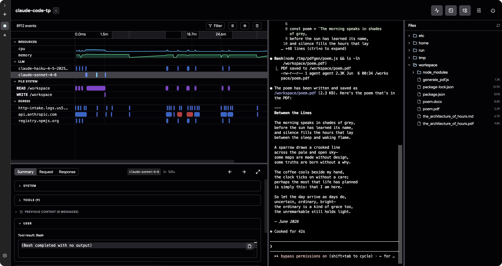
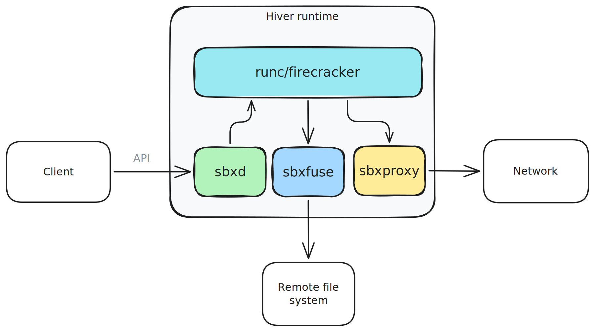

<p align="center">

</p>
<h1 align="center">Hiver</h1>
<h3 align="center">Chrome DevTools for Agents</h3>

<p align="center">
Run agents autonomously with controlled network access, auditable file operations, and full execution visibility.
</p>

<p align="center">

</p>

## 🚀 Getting Started

Install the CLI for the agent runtime:

```sh
npm install --global @hiver.sh/cli

# Or just use:
npx -y @hiver.sh/cli

# If you don't have NPM:
curl -fsSL https://hiver.sh/install.sh | sh
```

Use the CLI to manage sandboxes, stream live events, and launch the inspector — against a local stack or a remote deployment:

```sh
$ hiver

⬢ Hiver · Agent Runtime v0.1.3

  Usage: hiver <command> [options]

  Commands
    up       Bring up the stack
    down     Bring down the stack
    start    Start a sandbox
    stop     Stop a sandbox
    list     List the sandboxes
    events   Stream a sandbox's events live as they happen
    inspect  Launch the inspector
    bundle   Bundle a Docker image into a Hiver runtime image

  Run hiver <command> --help for command details.
```

### Launch first agent

#### TypeScript

Add dependency:
```sh
npm install --save @hiver.sh/client
```

First agent:
```ts
import * as hiver from "@hiver.sh/client";

const sandbox = await hiver.getOrCreateSandbox("agent-1");
const result = await sandbox.exec("claude -p 'Write a poem and save it as pdf'");
console.log(result.stdout);
```

#### Python

Add dependency:
```sh
pip install hiver-py
```

First agent:
```python
import asyncio
import hiver

async def main():
    sandbox = await hiver.get_or_create_sandbox("agent-1")
    result = await sandbox.exec("claude -p 'Write a poem and save it as pdf'")
    print(result["stdout"])

asyncio.run(main())
```

#### Go

Add dependency:
```sh
go get github.com/hiver-sh/hiver/client
```

First agent:
```go
import "github.com/hiver-sh/hiver/client"

c := client.NewClient("http://localhost:10000")
sandbox, _ := c.GetOrCreateSandbox(context.Background(), "agent-1", client.SandboxConfig{})

result, _ := sandbox.Exec(context.Background(),
    client.ExecRequest{Command: "claude -p 'Write a poem and save it as pdf'"})
fmt.Println(result.Stdout)
```

## Documentation

* [Docs](https://hiver.sh/docs)

* [Examples](https://hiver.sh/docs/examples)

### Isolation Modes
Container-level isolation using [`runc`](https://github.com/opencontainers/runc) and kernel-level isolation using [`firecracker`](https://github.com/firecracker-microvm/firecracker).

### File Systems
Local, Google Drive, Google Cloud Storage, Microsoft OneDrive, Amazon S3,Azure Blob Storage.

### Container Orchestration
Docker, k8s.


### Architecture

The Hiver runtime runs inside a container and is composed of sidecar processes. The agent sandbox runs on `runc` or `firecracker` as an untrusted workload. `sbxfuse` provides FUSE-backed volumes, `sbxproxy` transparently intercepts all TCP traffic (including TLS), and `sandboxd` wires everything together — serving the client API, reconciling sidecar policy, and streaming telemetry events.




The root filesystem is assembled with overlayfs, layering the agent's writes over the read-only base image for efficient snapshotting.

A typical deployment also includes a controller for sandbox lifecycle management and an Envoy gateway for external network access. All components ship out of the box but can be swapped for custom implementations.

Hiver is unopinionated about orchestration: the agent CLI or SDK can run entirely inside the sandbox or in a separate deployment. Because everything inside the sandbox is treated as untrusted, agents can call private APIs and access files without ever seeing auth tokens or secrets.

Getting started is straightforward — just run `hiver start` locally or deploy to the cloud using the same client library.

## License

Apache 2.0
