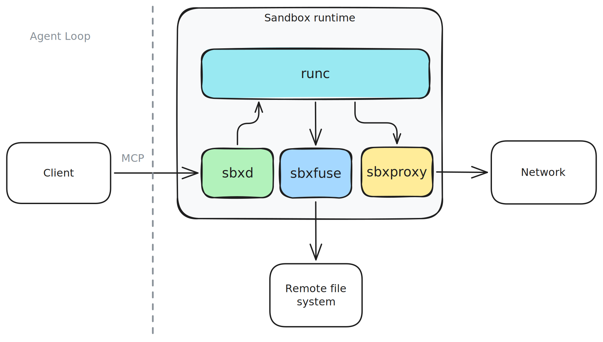

<p align="center">

</p>
<h1 align="center">Hive Sandbox</h1>

Hive provides each agent with a persistent, governed workspace — its own virtual filesystem and controlled network environment. Storage can be backed by _Google Drive_, _OneDrive_, _S3_, _GCS_, _Azure Blob Storage_, or local disks, allowing agents to work directly over real user and enterprise data.

## 🚀 Getting Started

Start the controller locally:
```sh
make up
```

Example client:
```ts
import * as hive from "hive";

const sandbox = await hive.getOrCreateSandbox("my-sandbox", {
  fs: [
    {
      backend: "local",
      mount: "/workspace",
      acls: [{ path: "/workspace/**", access: "rw" }],
    },
  ],
  egress: {
    allow: [{ host: "api.github.com", methods: ["GET"], paths: ["/repos/*"] }],
  },
});
```

Find a complete example [Stateful claude agent](client/typescript/examples/README.md).

### Custom Images

By default, an MCP server with `Bash`, and file operations tools is available via `sandbox.url`. That said,
but you can also use a custom Docker image.

Dockerfile:

```Dockerfile
FROM node:20-slim
# ....

EXPOSE 8080
ENTRYPOINT ["node", "index.js"]
```

Then build and bundle the image:

```sh
docker build -t custom-node:latest .
./scripts/bundle-images.sh custom-node:latest custom-node-hive-bundle:latest
```

Finally, set `image`:

```ts
const sandbox = await hive.getOrCreateSandbox("my-sandbox", {
  image: 'custom-node-hive-bundle:latest'
  // the rest
});

// `sandbox.url` points to the port `:8080`
```

</details>

## Documentation

- [TypeScript](client/typescript/README.md)
- Python (WIP)

## How it works

<p align="center">

</p>

A Hive sandbox is composed of an orchestrator (sbxd), 2 sidecar processes, and an agent container run via runc.

### Components

* **sbxd**: The orchestrator. Provides the API server and manages the lifecycle of the sidecars and agent container.
* **sbxfuse**: A FUSE filesystem sidecar that mediates and logs all file access. One instance runs per configured mount.
* **sbxproxy**: A transparent TCP proxy sidecar that enforces egress ACLs and logs all outbound requests. The agent does not need to set `HTTP_PROXY` — the kernel redirects all outbound TCP to sbxproxy transparently, so no changes to agent code are required. A CA certificate is automatically generated and injected into the agent container so TLS connections are trusted without any manual certificate configuration.
* **Agent container**: Runs in an isolated OCI container via [runc](https://github.com/opencontainers/runc). By default the image runs an MCP server that provides tools like `Bash` and `Read` to agents.
* **Controller**: Creates and destroys a sandbox.

Beyond security and ease of use, this architecture lets agents share a persistent file system. Each agent can accumulate its own findings, and a coordinating agent can read across all of them to synthesize global insights. This applies to skills, reports, or any other artifacts worth sharing.

<p align="center">

</p>

### Supported File Systems
* Google Drive
* Google Cloud Storage
* Local
* Microsoft OneDrive (WIP)
* Azure Blob Storage (WIP)
* Amazon S3 (WIP)
* Your own K/V store (WIP)

### Supported Platforms
* Docker
* k8s

## Why

Give an agent APIs and a persistent workspace, and it can write code, analyze data, generate reports, and accumulate artifacts across runs. Public and private data sources can be combined seamlessly within the same environment.

The filesystem doubles as durable state and a checkpoint store, allowing agents to resume work without rebuilding context each session. By persisting intermediate artifacts, caches, and outputs, Hive reduces redundant computation and token usage while enforcing auditable filesystem and network boundaries.

## License

Apache 2.0
